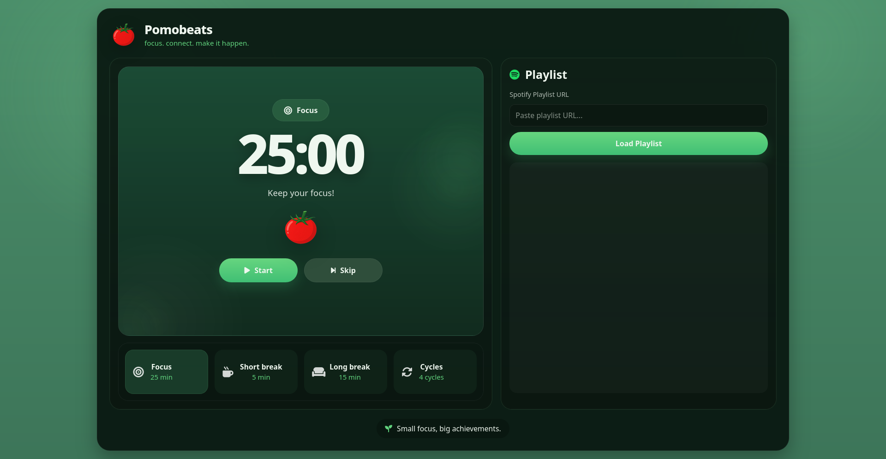
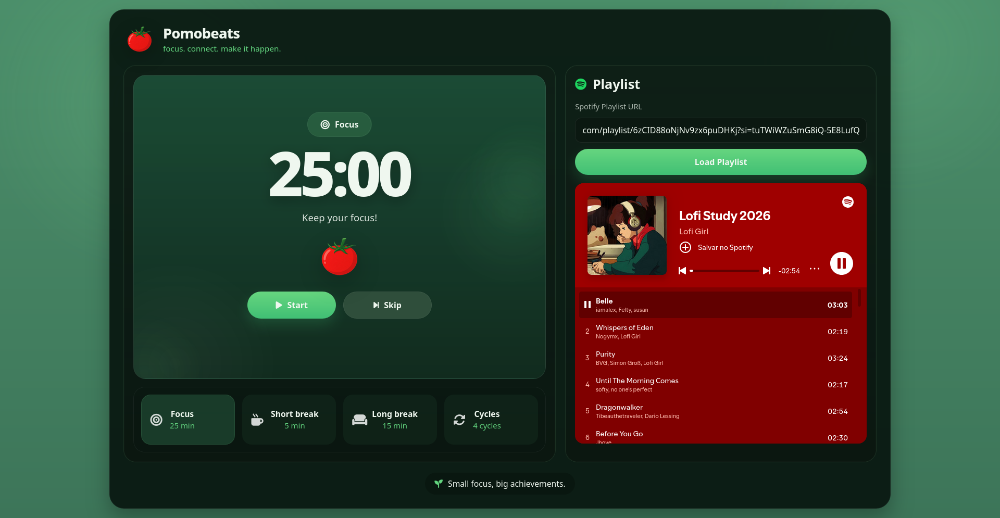
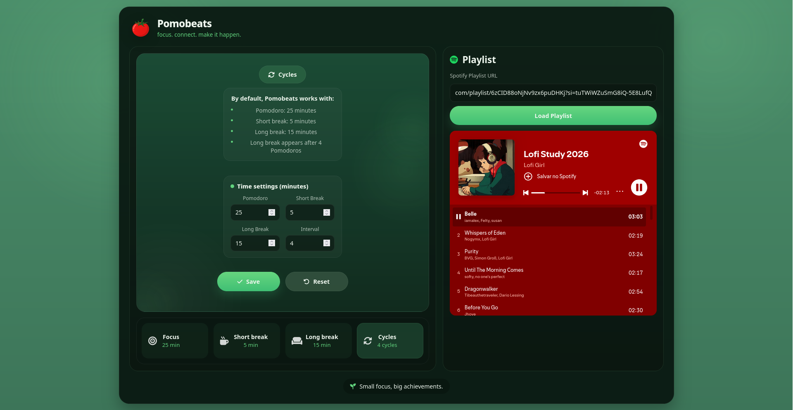

# 🍅 Pomobeats

Pomobeats is a modern Pomodoro Timer web application designed to help users stay focused, organized, and productive during study or work sessions. Inspired by the Pomodoro Technique, the application encourages structured work intervals followed by short and long breaks, promoting better concentration and reducing mental fatigue.

To create a more enjoyable productivity experience, Pomobeats integrates Spotify playlists directly into the interface, allowing users to listen to their favorite music without leaving the application. The project also includes customizable timer settings, browser notifications, local storage support, and a responsive interface optimized for different screen sizes.

Developed using HTML, CSS, and JavaScript, Pomobeats was built as a personal project to strengthen front-end development skills, including DOM manipulation, event handling, application state management, responsive layouts, browser APIs, and user interface design.

The goal of this project is to provide a simple yet effective tool that combines productivity techniques and music, helping users maintain focus and build better work and study habits.

---

## 🌐 Live Demo

Try Pomobeats directly in your browser:

🔗 

No installation required — simply open the application and start focusing.

---

## ✨ Features

- ⏱️ Focus, Short Break, and Long Break modes
- 🔄 Customizable Pomodoro cycles
- 🔔 Browser notifications when sessions end
- 🎵 Spotify playlist integration
- 📱 Responsive design for desktop and mobile devices
- 🎨 Modern and intuitive user interface

---

## 📸 Preview





---

## 🚀 Technologies Used

<div align="center">


</div>

---

## 🛠️ Installation


If you'd like to run the project locally:

```bash
git clone https://github.com/arthurolii/pomobeats.git
cd pomobeats
```

Then open the `index.html` file in your browser.

---

## 📖 How Pomobeats Works

Pomobeats follows the Pomodoro Technique, a time-management method designed to improve focus and productivity. A typical cycle consists of:

1. 🍅 A **Focus Session** where you work without distractions.
2. ☕ A **Short Break** to rest and recharge.
3. 🔄 After a configurable number of focus sessions, a **Long Break** is triggered automatically.

All timer durations and cycle settings can be customized in the **Cycles** tab according to your personal study or work routine.

### 🎵 Spotify Integration

The Spotify tab allows you to listen to your favorite playlists while studying or working.

To use this feature:

1. Open Spotify and copy the URL of a playlist.
2. Paste the playlist link into the input field.
3. Click **Load Playlist**.

> **Important:** To listen to full tracks, you must be logged into your Spotify account in your browser. If you are not logged in, Spotify may only play short previews of songs, depending on availability and Spotify restrictions.

Your playlist link is automatically saved in your browser, so you won't need to paste it again the next time you open Pomobeats.

---

## 📚 What I Learned

This project helped me improve my knowledge of:

- DOM Manipulation
- Event Handling
- Browser Notifications API
- Local Storage
- Responsive Design
- Application State Management
- Clean CSS Organization

---

## 👨‍💻 Author

Developed by **Arthur Oliveira**.

📫 Connect with me:

- 💼 LinkedIn: https://www.linkedin.com/in/arthur-oliveira-21ab8a236/?locale=en
- 🐙 GitHub: https://github.com/Arthur0li

---

## ⭐ Support

If you enjoyed this project, consider giving it a star on GitHub!


